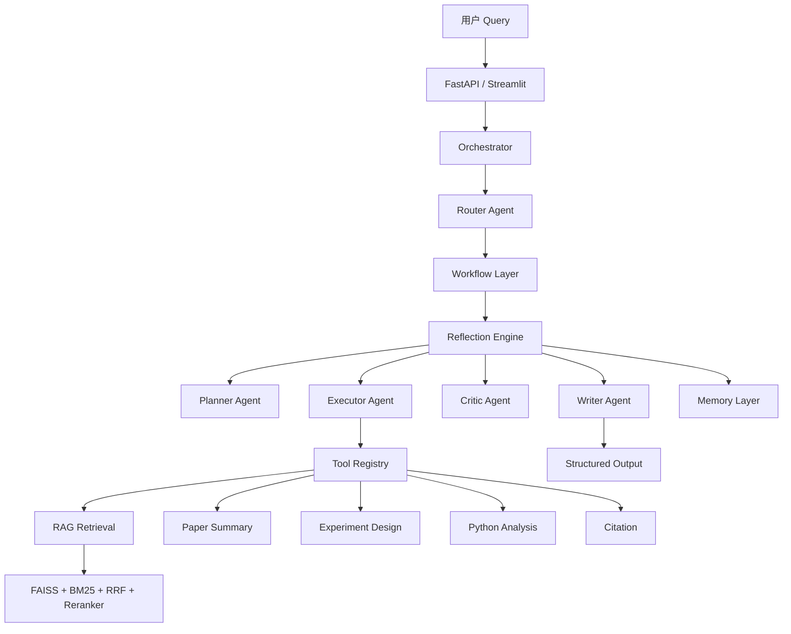
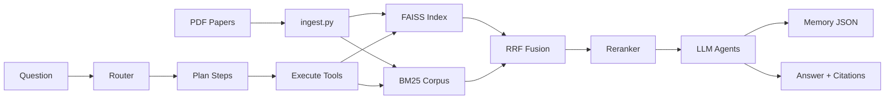
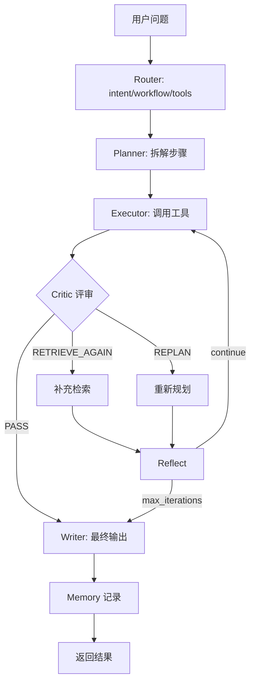

# Agentic RAG Research Copilot — 完整架构文档

> v3.0 | Incremental Refactoring | 基于现有仓库增量升级

---

## 第一部分：Repository Audit（仓库审计）

### 1. 当前目录结构

```
RAG_Project/
├── app/
│   ├── agent/              # Agent 层（Router/Planner/Executor/Critic/Writer/Reflection）
│   ├── tools/              # Tool Calling Framework（5 工具）
│   ├── memory/             # Short/Long/Research Memory
│   ├── workflows/          # QA/Paper/Experiment/Research 工作流
│   ├── evaluation/         # RAGAS 评估
│   ├── query/              # Query Understanding（分类/改写/扩展）
│   ├── retrieval/          # Hybrid Retrieval（FAISS+BM25+RRF+Reranker）
│   ├── pipelines/          # Task-aware Pipeline（复用为 Tool 底层）
│   ├── output/             # 结构化输出格式化
│   ├── orchestrator.py     # 统一入口 ask()
│   ├── main.py             # FastAPI
│   ├── ingest.py           # PDF 入库
│   ├── config.py           # 配置管理
│   ├── llm.py              # LLM + Embedding
│   ├── exceptions.py       # 异常体系
│   └── logging_config.py   # 日志
├── data/papers/            # PDF 论文库
├── data/memory/            # 持久化 Memory（运行时生成）
├── vector_store/           # FAISS + BM25 索引
├── scripts/                # demo / cli
├── docs/                   # 设计文档
├── streamlit_app.py        # Web UI
├── Dockerfile / docker-compose.yml
└── requirements.txt
```

### 2. 当前功能模块

| 模块 | 状态 | 说明 |
|------|------|------|
| PDF Ingest | ✅ | PyPDF → Chunk → FAISS + BM25 |
| Hybrid Retrieval | ✅ | FAISS + BM25 + RRF + Reranker |
| Query Understanding | ✅ | Classify / Rewrite / Multi-Query |
| Agent Router (v2) | ✅ 已升级 | 原 `agent/router.py` 保留，v3 使用 `copilot_router.py` |
| Pipelines | ✅ | QA / Paper Summary / Experiment Design |
| FastAPI | ✅ | `/query` `/evaluate` `/detect-hallucination` |
| Streamlit UI | ✅ | 多轮对话 + Agent 链路可视化 |
| Agent Layer (v3) | ✅ 新增 | Router/Planner/Executor/Critic/Writer |
| Reflection Loop | ✅ 新增 | max_iterations 可配置 |
| Tool System | ✅ 新增 | 5 工具 + Registry |
| Memory | ✅ 新增 | 短/长/研究记忆 |
| Workflows | ✅ 新增 | 4 种工作流 |
| RAGAS Evaluation | ✅ 新增 | 可选启用 |
| Docker | ✅ 新增 | Dockerfile + compose |

### 3. 当前 RAG 流程

```
PDF → RecursiveCharacterTextSplitter(500/50)
    → FAISS Embedding + BM25 corpus.pkl

Query → Router(intent/workflow/tools)
      → Planner(steps)
      → Executor(rag_retrieval → pipeline tools → citation)
      → Critic(PASS/RETRIEVE_AGAIN/REPLAN)
      → Reflect → Replan/Re-retrieve (loop ≤ max_iterations)
      → Writer(final answer / structured report)
      → Memory(record)
```

### 4. 当前 UI 能力

- Streamlit 聊天界面，展示 intent/workflow/迭代次数
- Agent 决策链路 JSON 可视化
- 结构化输出 / 引用来源 / BibTeX 展开
- Session ID 支持（Memory 关联）

### 5. 当前检索能力

| 阶段 | 技术 |
|------|------|
| Dense | FAISS + multilingual MiniLM |
| Sparse | BM25Okapi |
| Fusion | Reciprocal Rank Fusion (k=60) |
| Rerank | bge-reranker-v2-m3 Cross-Encoder |
| Query 增强 | LLM Rewrite + Multi-Query Expansion |

### 6. 当前代码组织

- **分层清晰**：query → retrieval → tools/pipelines → agent → workflow → orchestrator
- **增量兼容**：`rag_chain.py` 保留，转发至 orchestrator；旧 `AgentRouter` 保留
- **配置集中**：`config.py` + `.env`

### 7. 项目等级评估

| 等级 | 特征 | 本项目 |
|------|------|--------|
| Level 1 ChatPDF | 单 PDF + 单向量检索 | 已超越 |
| Level 2 Basic RAG | FAISS + LLM | 已超越 |
| Level 3 Production RAG | Hybrid + Rerank + Task Routing | v2.0 已达成 |
| **Level 4 Agentic RAG** | Agent + Planning + Reflection + Tools + Memory | **v3.0 当前阶段** |

**结论：项目从 Level 3 升级至 Level 4 Agentic RAG Research Copilot。**

---

## 第二部分：Gap Analysis

### 升级前（v2.0）缺失组件

| 组件 | v2.0 | v3.0 |
|------|------|------|
| Router (intent/workflow/tools) | 部分（仅 task_type） | ✅ CopilotRouter |
| Planner | ❌ | ✅ PlannerAgent |
| Executor | ❌（Pipeline 直连） | ✅ ExecutorAgent |
| Critic | ❌ | ✅ CriticAgent |
| Reflection | ❌ | ✅ ReflectionEngine |
| Memory | ❌ | ✅ 三层 Memory |
| Tool Calling | ❌ | ✅ ToolRegistry + 5 Tools |
| Workflow | 部分（Pipeline 路由） | ✅ 4 Workflows |
| Evaluation | ❌ | ✅ RAGAS（可选） |
| Research Report | ❌ | ✅ WriterAgent |
| Docker/Logging | 部分 | ✅ 完整 |

---

## 第三部分：Target Architecture

### System Architecture Diagram



### Data Flow Diagram



### Agent Decision Flow Diagram



---

## 第十三部分：Refactoring Plan（逐文件）

### 新增文件

| 文件 | 用途 |
|------|------|
| `app/agent/copilot_router.py` | LLM Router（intent/workflow/tools） |
| `app/agent/planner.py` | Planner Agent |
| `app/agent/executor.py` | Executor Agent |
| `app/agent/critic.py` | Critic Agent |
| `app/agent/writer.py` | Writer Agent |
| `app/agent/reflection.py` | Reflection Loop 引擎 |
| `app/tools/*` | 5 工具 + Registry |
| `app/memory/*` | 三层 Memory |
| `app/workflows/*` | 4 工作流 |
| `app/evaluation/ragas_eval.py` | RAGAS 评估 |
| `app/exceptions.py` | 异常体系 |
| `app/logging_config.py` | 日志 |
| `Dockerfile` / `docker-compose.yml` | 容器化 |
| `docs/AGENTIC_COPILOT_ARCHITECTURE.md` | 本文档 |

### 修改文件

| 文件 | 变更 |
|------|------|
| `app/orchestrator.py` | 接入 ReflectionEngine + Workflow |
| `app/main.py` | v3.0 API + evaluation endpoints |
| `app/config.py` | Agent/Memory/Eval 配置项 |
| `app/agent/prompts.py` | 全部 Agent Prompt |
| `streamlit_app.py` | 展示 Reflection/Workflow/Memory |
| `requirements.txt` | numpy/pandas + ragas 注释 |
| `.env.example` | 新配置项 |
| `scripts/demo.py` | 增加 research_analysis 示例 |

### 保留未删除（向后兼容）

| 文件 | 原因 |
|------|------|
| `app/agent/router.py` | v2 AgentRouter，Pipeline 直连逻辑可参考 |
| `app/rag_chain.py` | 旧接口兼容层 |
| `app/query/*` | 被 RAGRetrievalTool 复用 |
| `app/pipelines/*` | 被 Tool 层复用 |
| `app/retrieval/*` | Hybrid Retrieval 核心 |

### 无需删除

无文件需要删除，符合 Incremental Refactoring 原则。

---

## 第十四部分：关键 Prompt 索引

见 `app/agent/prompts.py`：

- `ROUTER_AGENT_PROMPT` — intent/workflow/tools
- `PLANNER_AGENT_PROMPT` — 步骤拆解
- `CRITIC_AGENT_PROMPT` — PASS/RETRIEVE_AGAIN/REPLAN
- `REFLECT_AGENT_PROMPT` — 反思与调整
- `WRITER_AGENT_PROMPT` / `RESEARCH_REPORT_PROMPT` — 最终输出
- `PAPER_SUMMARY_PROMPT` / `EXPERIMENT_DESIGN_PROMPT` — 结构化输出

---

## 启动方式

```powershell
# 构建索引
python -m app.ingest

# Web UI
streamlit run streamlit_app.py

# API
uvicorn app.main:app --reload

# Docker
docker-compose up api
```

## Evaluation 启用

```powershell
pip install ragas datasets
# .env 中设置 ENABLE_RAGAS=true
curl -X POST http://localhost:8000/evaluate -H "Content-Type: application/json" -d "{\"question\":\"...\",\"answer\":\"...\",\"contexts\":[\"...\"]}"
```
